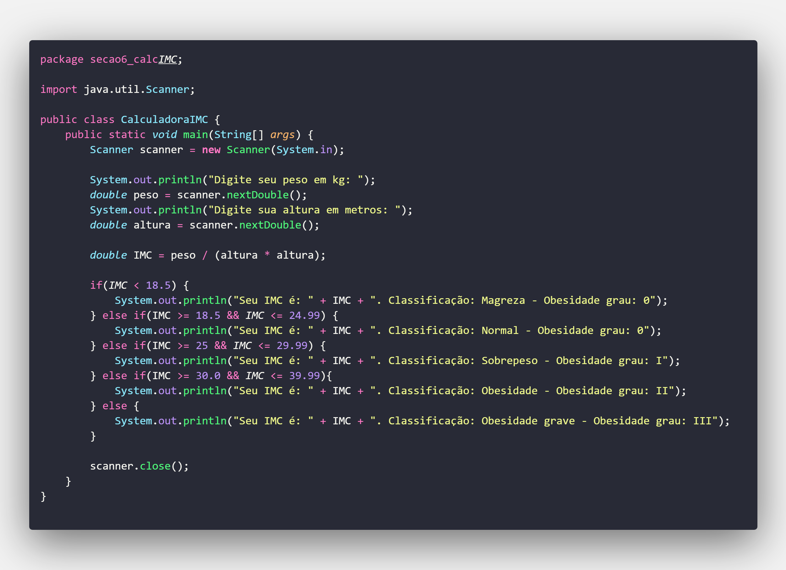
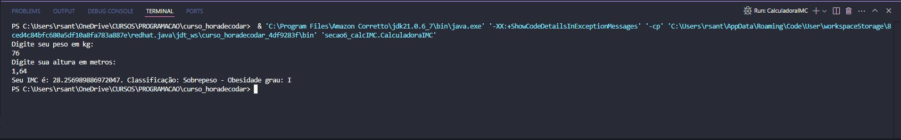

# 🧮 Calculadora de IMC em Java

Bem-vindo ao projeto **Calculadora de IMC**! Este é um aplicativo simples desenvolvido em **Java** que permite calcular o **Índice de Massa Corporal (IMC)** com base na altura e no peso informados pelo usuário.

## 🚀 Sobre o Projeto

Este projeto tem como objetivo principal demonstrar o uso básico de entrada de dados em Java utilizando a biblioteca `java.util.Scanner`. Ele serve como um ótimo exemplo para iniciantes que estão aprendendo lógica de programação, estrutura condicional e manipulação de entrada/saída no console.

## 💡 Funcionalidades

- Leitura de dados do usuário (peso e altura);
- Cálculo do IMC com base na fórmula:  
  `IMC = peso / (altura * altura)`
- Exibição do resultado do IMC;
- Classificação do resultado de acordo com os critérios da OMS:
  - Abaixo do peso
  - Peso normal
  - Sobrepeso
  - Obesidade grau I, II ou III

## 🛠️ Tecnologias Utilizadas

- Linguagem: **Java**
- Biblioteca padrão: `java.util.Scanner`

## 📥 Como Executar

1. **Clone o repositório:**
   ```bash
   git clone https://github.com/DevRafaSantos/CalculadoraIMCJava.git
   ```
2. **Compile o código:**
   ```bash
   javac CalculadoraIMC.java
   ```
3. **Execute o programa:**
   ```bash
   java CalculadoraIMC
   ```
## 🖼️ Imagens do Projeto

### 📌 Trecho do Código


### 📌 Resultado no Terminal


## 📸 Exemplo de Uso

```plaintext
Digite seu peso (em kg): 70
Digite sua altura (em metros): 1.75
Seu IMC é: 22.86
Classificação: Peso normal
```

## 📚 Aprendizados

Este projeto me permitiu:

- Praticar entrada e saída de dados em Java;
- Entender melhor estruturas condicionais;
- Trabalhar com operações matemáticas;
- Aprender boas práticas de documentação.

## 🤝 Contribuições

Contribuições são bem-vindas! Se você quiser sugerir melhorias, abrir issues ou criar um pull request, fique à vontade!

---

📌 **Desenvolvido com dedicação e curiosidade 💻 por Rafael Santos**
